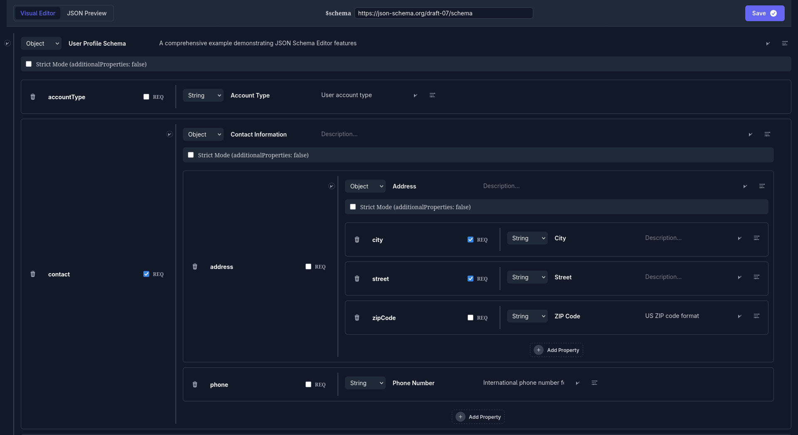

# JSON Schema Editor

[](https://github.com/preciz/json_schema_editor/actions/workflows/test.yml)

A Phoenix LiveComponent for visually building, editing, and validating JSON Schemas.



## Features

- **Visual Editing**: Recursively build and edit deeply nested objects and arrays.
- **Advanced Logic**: Support for `oneOf`, `anyOf`, `allOf` and conditional keywords (`if`, `then`, `else`, `not`).
- **Test Lab**: Validate sample JSON data against your schema in real-time with detailed error reporting.
- **Schema Generation**: Automatically infer a JSON Schema from a pasted JSON object.
- **Undo/Redo**: Full history support for all schema modifications.
- **Real-time Validation**: In-editor logic checking (e.g., `min <= max`) with immediate visual feedback.
- **Draft 07 Support**: Includes constraints, enums, constants, `null` type, and $schema management.
- **Copy to Clipboard**: One-click export of the generated schema.
- **Lightweight**: Zero external JS dependencies (uses native Phoenix hooks), only requires `phoenix_live_view`.
- **JSON Viewer**: Dedicated component for displaying JSON with syntax highlighting and indentation guides.
- **JSON Editor**: Specialized component for editing JSON data according to a provided JSON Schema.

## Installation

This library uses a small CSS file for styling and a JavaScript hook for clipboard functionality.

#### 1. Add `json_schema_editor` to your list of dependencies in `mix.exs`:

```elixir
def deps do
  [
    {:json_schema_editor, "~> 0.9.6"}
  ]
end
```

#### 2. Import the library's CSS in your `assets/css/app.css` (or equivalent):

```css
@import "../../deps/json_schema_editor/assets/css/json_schema_editor.css";
```

#### 3. Configure JavaScript Hooks (Clipboard Support):

In your `assets/js/app.js`, import and register the hook:

```javascript
import { Hooks as JSEHooks } from "../../deps/json_schema_editor/assets/js/json_schema_editor"

// ... existing hooks
let liveSocket = new LiveSocket("/live", Socket, {
  params: {_csrf_token: csrfToken},
  hooks: { ...JSEHooks, ...other_hooks }
})
```

## Usage

The editor supports JSON Schema Draft 07. It automatically injects the `$schema` URI if not provided.

### 1. Initialize the Schema

```elixir
def mount(_params, _session, socket) do
  schema = %{
    "type" => "object",
    "properties" => %{
      "user" => %{
        "type" => "object",
        "properties" => %{
          "name" => %{"type" => "string", "minLength" => 2}
        }
      }
    }
  }

  {:ok, assign(socket, my_schema: schema)}
end
```

### 2. Render the Component

```heex
<.live_component
  module={JSONSchemaEditor}
  id="json-editor"
  schema={@my_schema}
  on_save={fn updated_schema -> send(self(), {:schema_saved, updated_schema}) end}
/>
```

### 3. Handle Updates

```elixir
def handle_info({:schema_saved, updated_schema}, socket) do
  # The schema is guaranteed to be logically consistent here
  {:noreply, assign(socket, my_schema: updated_schema)}
end
```

### JSON Viewer

You can also use the standalone viewer component to display any JSON data with syntax highlighting.

```heex
<JSONSchemaEditor.Viewer.render json={@my_schema} />
```

It accepts maps, lists, or even raw JSON strings (which it will attempt to decode and pretty-print).

### JSON Editor

The library also includes a dedicated JSON Editor component for editing JSON data according to a schema.

```heex
<.live_component
  module={JSONSchemaEditor.JSONEditor}
  id="json-data-editor"
  schema={@my_schema}
  json={@my_data}
  on_save={fn updated_json -> send(self(), {:json_updated, updated_json}) end}
/>
```

It features real-time validation, a visual tree editor, and a live preview of the edited data.

## Development

### Running Tests
```bash
mix test --cover
```

### Running the Demos
```bash
# Main Schema Editor Demo
elixir examples/demo.exs

# JSON Data Editor Demo
elixir examples/json_editor.exs
```
Visit `http://localhost:4040` (or `4041` for the JSON editor) to see the components in action.
